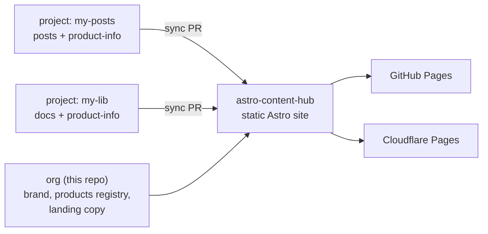

> This page is the **"why"** of `astro-content-hub`. Read it first if you are
> evaluating the template or wondering how to position your own hub. It is
> deliberately opinionated: the template makes a set of trade-offs on purpose,
> and they are the reason it looks the way it does.

## The problem

Most organizations with more than one open-source project end up with the same
situation:

- Each project has its own README, its own `docs/`, and often its own
  **separate GitHub Pages site** — each with a different look, a different
  URL, and different maintenance burden.
- Visitors have to know *which* project they are looking for before they can
  find anything. There is no front door to the organization.
- The "product" of an open-source project is more than its docs: it is a
  landing page that explains *what it is, why you want it, how to install it,
  and where the docs live*. Few projects maintain that page, because it is yet
  another thing to build and keep in sync.

The result: great code, scattered and inconsistent public presence.

## The insight

The docs and the product page of a project are **the same content seen from
two sides**. A project author already writes docs — they do not want to also
maintain a separate marketing page. What they need is a **place that turns
their existing docs into a good-looking product page for free**.

And an organization needs more than a pile of links: it needs a **front door**
— an org page that says who you are, what you build, and where each product
lives.

`astro-content-hub` combines both:

- **Org layer** — a landing page and brand for the organization itself.
- **Product layer** — every registered product gets a landing page (what it
  is, features, install, highlights) generated from `product-info` content.
- **Docs layer** — each product's docs are aggregated into the same site, so
  "the docs" and "the product page" live under one roof, one URL, one search.

One repo hosts the site; each project contributes its docs (and optionally a
`product-info` file) through a pull request — nothing lands without review.

## The three tiers (and why they matter)

The template is split into **Machinery / Your site / Extensions**, documented
in [Architecture](./architecture.md). This is not an internal detail; it is
the product philosophy in code:

- **Machinery** is the part with (mostly) one correct answer: routing, i18n
  fallback, content collections, the sync pipeline. Adopters should never need
  to edit it.
- **Your site** is the part with many correct answers: the org's copy, the
  product registry, the look and feel. This is where an organization makes the
  hub *its own*.
- **Extensions** are opt-in hooks: a custom landing for one product, a
  per-product theme, a rich `product-info` landing. A product can ship a
  better page without touching the shared site.

The point of the split is **upgradability**: the Machinery evolves upstream,
your branding stays untouched, and `npm run check:upstream` (see
[Upgrading](./upgrading.md)) tells you when a release needs a human decision.

## What the template deliberately does NOT do

- **It is not a CMS.** Content lives in Git, reviews happen in pull requests.
  There is no admin UI, no database, no editor roles. That is a feature: the
  pipeline is reviewable, versioned, and free to run forever.
- **It is not a docs framework for a single repo.** If you have one project
  and one docs folder, use [Starlight](https://starlight.astro.build/),
  Docusaurus, or VitePress directly. This template exists for the *org +
  multiple products* case.
- **It does not fetch content at build time.** It aggregates through
  *synced PRs*, not by cloning source repos at build time. Builds stay offline
  and deterministic, and every change is human-reviewed before it ships. The
  trade-off (a sync workflow per source repo) is deliberate.
- **It is not a marketing site builder.** The landing and product pages are
  content-driven and configurable, but the template's priority is a clean,
  fast, content-first presence — not a page builder with drag-and-drop.

## Who it is for

- **An organization (or a person) building multiple open-source projects** who
  wants one branded front door and one URL per product, without each project
  maintaining its own site.
- **Project authors** who want a decent public page for their project by
  writing docs and a small `product-info` file — no separate site to build or
  host.
- **Maintainers who care about review** — content only lands via pull request,
  so nothing ships to the public without a human looking at it.

## The model in one diagram

## The promise

Give the hub your products' docs (and a bit of `product-info`), and the hub
gives you back an organization with a front door, a branded product page per
product, localized fallback, search, and free deployment — all maintained
through reviewable pull requests, all upgradable as the template evolves.

The rest of this documentation explains the how. This page is the why.
