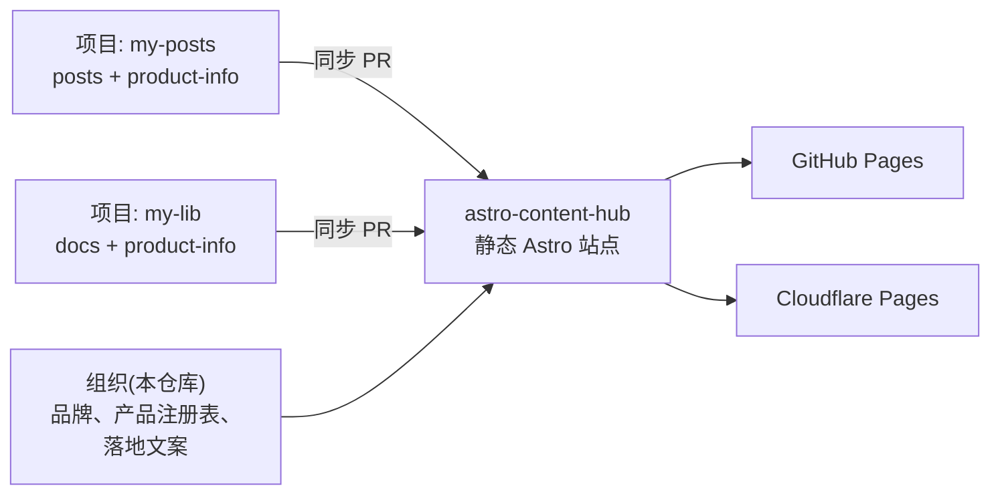

> 本页是 `astro-content-hub` 的"为什么"。如果你在评估这个模板,或想弄清楚
> 如何定位你自己的 hub,请先读它。它刻意带有观点:模板做了一系列有意的
> 取舍,而这些取舍正是它长成这样的原因。

## 问题

拥有不止一个开源项目的组织,几乎都会落入同一种处境:

- 每个项目都有自己的 README、自己的 `docs/`,常常还有自己**独立的
  GitHub Pages 站点** —— 外观各异、URL 各异、维护成本各异。
- 访客必须先知道自己在找**哪个**项目,才能找到任何东西。组织没有
  前门。
- 开源项目的"产品"不止是文档:它是一个落地页,讲清楚*这是什么、为什么
  要用、怎么安装、文档在哪*。很少有项目维护这个页面,因为那又是另一件
  要建、要维护的事。

结果是:代码很好,公开形象却散乱而不一致。

## 洞察

项目的文档和产品页,是**同一份内容从两个角度看**。项目作者本来就要写
文档 —— 他们不想再维护一个独立的营销页。他们需要的是一处**能把自己现有
的文档免费变成好看产品页的地方**。

而组织需要的也不只是一堆链接:它需要一个**前门** —— 一个说明你是谁、
你做什么、每个产品在哪的组织页。

`astro-content-hub` 把两者合二为一:

- **组织层** —— 面向组织本身的落地页与品牌。
- **产品层** —— 每个已注册产品都得到一个落地页(是什么、特性、安装、
  亮点),由 `product-info` 内容生成。
- **文档层** —— 每个产品的文档聚合进同一个站点,于是"文档"和"产品页"
  在同一屋檐下、同一 URL、同一搜索里。

一个仓库托管站点;每个项目通过拉取请求贡献文档(以及可选的
`product-info` 文件) —— 未经 review,什么都不会上线。

## 三层划分(以及为什么重要)

模板被划分为 **Machinery / Your site / Extensions**,详见
[架构](./architecture.md)。这不是内部细节;它就是产品理念的代码化:

- **Machinery** 是(大体上)只有一个正确答案的部分:路由、i18n 回退、
  内容集合、同步管线。采用者永远不需要改它。
- **Your site** 是有很多正确答案的部分:组织的文案、产品注册表、
  外观。这是组织让 hub *成为自己的* 的地方。
- **Extensions** 是可选钩子:某个产品的自定义落地页、按产品的主题、
  丰富的 `product-info` 落地页。产品可以不碰共享站点就拥有更好的页面。

分层的目的在于**可升级性**:Machinery 在上游演进,你的品牌原封不动,
`npm run check:upstream`(见[升级](./upgrading.md))会告诉你某个发布
何时需要人工决策。

## 模板刻意不做的事

- **它不是 CMS。** 内容活在 Git 里,review 发生在拉取请求中。没有管理
  界面、没有数据库、没有编辑角色。这是特性:管线可审阅、可版本化、
  且可以永远免费运行。
- **它不是单仓库的文档框架。** 如果你只有一个项目、一个 docs 目录,
  直接使用 [Starlight](https://starlight.astro.build/)、Docusaurus 或
  VitePress。这个模板为 *组织 + 多产品* 的场景而存在。
- **它不在构建时拉取内容。** 它通过*同步 PR* 聚合,而不是在构建时 clone
  源仓库。构建保持离线、确定,并且每个变更在上线前都经过人工 review。
  取舍(每个源仓库要配一个同步工作流)是有意为之。
- **它不是营销站生成器。** 落地页与产品页由内容驱动、可配置,但模板的
  优先级是干净、快速、内容优先的门面 —— 不是拖拽式页面构建器。

## 它适合谁

- **正在构建多个开源项目的组织(或个人)**,希望有一个品牌前门和
  每个产品一个 URL,而不用每个项目各自维护站点。
- **项目作者**,希望通过写文档和一份小小的 `product-info` 文件,就为
  自己的项目得到一个像样的公开页面 —— 无需另建、另托站点。
- **在乎 review 的维护者** —— 内容只通过拉取请求上线,所以没有任何
  东西会在未经人眼确认的情况下公之于众。

## 模型一图流

## 承诺

把项目的文档(以及一点 `product-info`)交给 hub,hub 就还给你一个
组织:有前门、每个产品一个品牌落地页、本地化回退、搜索、免费部署 ——
全部通过可审阅的拉取请求维护,全部随模板演进而可升级。

本文档的其余部分讲"怎么做"。本页讲"为什么"。
